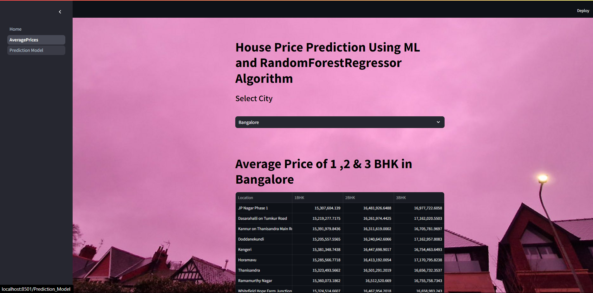
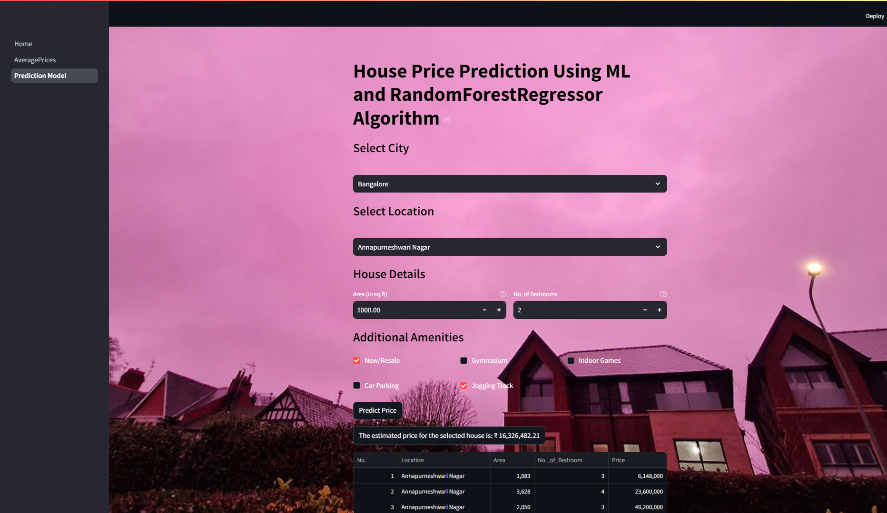

<h1>House Price Prediction & Suggestions on Custom Dataset</h1>

This project implements a <strong>house price prediction</strong> system using machine learning models, particularly focusing on two major Indian cities, <strong>Mumbai</strong> and <strong>Bangalore</strong>. It leverages a custom dataset and applies a <strong>Random Forest Regressor</strong> to predict property prices based on various features such as location, area, and amenities. The project includes multiple pages for visualizing average prices, predicting prices based on user input, and backend data processing.

<h2>Features</h2>
<ul>
  <li><strong>Prediction Page</strong>: Allows users to predict the price of a property in selected cities (Mumbai and Bangalore) by inputting property details like location, area, and number of bedrooms.</li>
  <li><strong>Average Price Display</strong>: Displays the average price of 1, 2, and 3 BHK apartments in the selected city.</li>
  <li><strong>Custom Dataset</strong>: Backend processing for generating and using city-specific datasets.</li>
  <li><strong>Additional Amenities</strong>: Takes into account amenities such as gymnasium, car parking, indoor games, and jogging track.</li>
  <li><strong>Machine Learning Model</strong>: Uses the RandomForestRegressor model for price prediction.</li>
</ul>

<h2>Project Structure</h2>
<ul>
  <li><strong>AveragePrice Page</strong>: Displays average prices of properties in a city based on a predefined dataset.</li>
  <li><strong>Prediction Model Page</strong>: Allows users to input property features (location, area, BHK, and amenities) to predict the price using a pre-trained model.</li>
  <li><strong>Price_Prediction.py</strong>: Backend logic for loading datasets, training models, and predicting house prices.</li>
  <li><strong>train.csv</strong>, <strong>Bangalore.csv</strong>: Datasets used for Mumbai and Bangalore, respectively, for training the model.</li>
  <li><strong>model.pkl</strong>, <strong>model2.pkl</strong>: Pre-trained RandomForest models for price prediction for both cities.</li>
</ul>

<h2>How to Run the Project</h2>
<ol>
  <li><strong>Clone the Repository:</strong></li>
  <pre><code>git clone https://github.com/yourusername/house-price-prediction.git
cd house-price-prediction</code></pre>

  <li><strong>Install Dependencies:</strong> You need Python installed on your machine, along with the necessary libraries:</li>
  <pre><code>pip install -r requirements.txt</code></pre>

  <li><strong>Launch the Streamlit Application:</strong> Run the Streamlit app to start predicting house prices:</li>
  <pre><code>streamlit run app.py</code></pre>
</ol>

<h2>Usage</h2>

<h3><strong>Average Price Page</strong></h3>
<ol>
  <li>Select a city (Mumbai/Bangalore).</li>
  <li>View the average price of 1 BHK, 2 BHK, and 3 BHK properties for that city, displayed in a table format.</li>
</ol>

<h3><strong>Prediction Page</strong></h3>
<ol>
  <li>Select the city and location.</li>
  <li>Enter the property details like area, number of bedrooms, and available amenities (e.g., gym, car parking).</li>
  <li>Click on "Predict Price" to get an estimated property price based on the input.</li>
</ol>

<h2>Backend Model Processing</h2>

The model uses a RandomForestRegressor trained on city-specific datasets:

<ul>
  <li><strong>Mumbai</strong>: Data stored in <code>train.csv</code>.</li>
  <li><strong>Bangalore</strong>: Data stored in <code>Bangalore.csv</code>.</li>
</ul>

<h3>Steps:</h3>
<ul>
  <li>Load the relevant dataset for the selected city.</li>
  <li>Encode categorical features such as location.</li>
  <li>Train a RandomForestRegressor model and save it as <code>model.pkl</code> and <code>model2.pkl</code> for Mumbai and Bangalore, respectively.</li>
</ul>

<h3>Dataset Generation</h3>
<ul>
  <li>Backend script to generate datasets for average prices of properties in different locations of Mumbai and Bangalore, saved as <code>mumbai_prices.csv</code> and <code>bangalore_prices.csv</code>.</li>
</ul>

<h2>Technologies Used</h2>
<ul>
  <li><strong>Python</strong>: For data processing and model training.</li>
  <li><strong>Pandas</strong>: For handling datasets.</li>
  <li><strong>Scikit-learn</strong>: For machine learning model (RandomForestRegressor).</li>
  <li><strong>Streamlit</strong>: For creating an interactive web interface.</li>
  <li><strong>Pickle</strong>: For saving and loading pre-trained models.</li>
</ul>

<h2>Future Enhancements</h2>
<ul>
  <li><strong>Expand to Other Cities</strong>: Extend the application to predict prices for more cities.</li>
  <li><strong>Real-Time Data</strong>: Incorporate real-time property listings for more accurate predictions.</li>
  <li><strong>Advanced Feature Engineering</strong>: Add more features such as proximity to metro stations, crime rates, and market trends to improve model accuracy.</li>
</ul>

<h2>License</h2>

This project is licensed under the MIT License. See the <a href="LICENSE">LICENSE</a> file for more information.

<h2>Contributing</h2>

Contributions are welcome! Please feel free to submit a Pull Request with any improvements or suggestions for enhancing the project.

<h2>Output Screenshots</h2>

Include screenshots of the output here:

